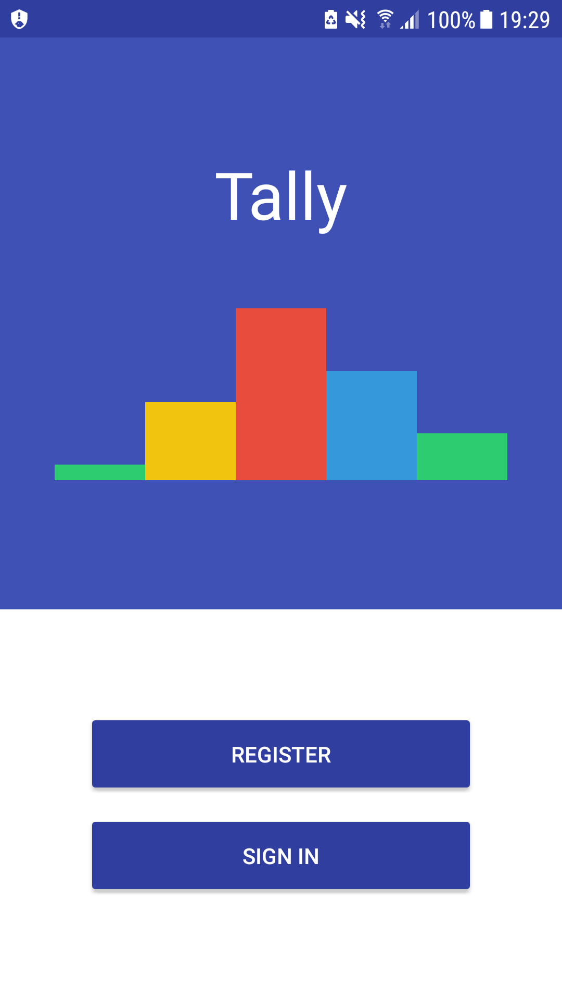
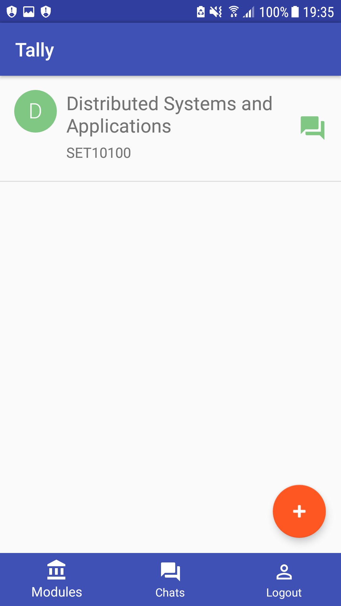
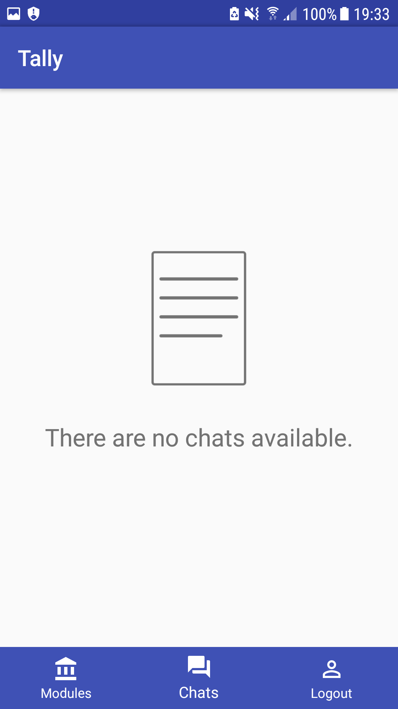
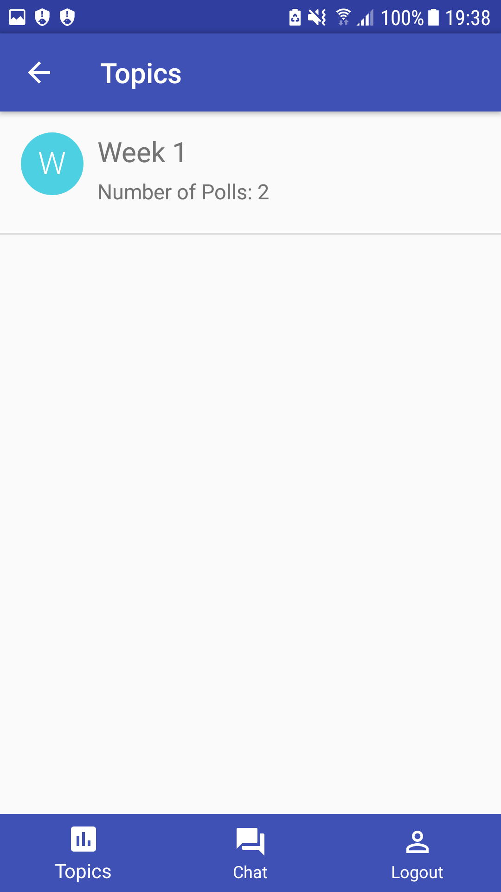
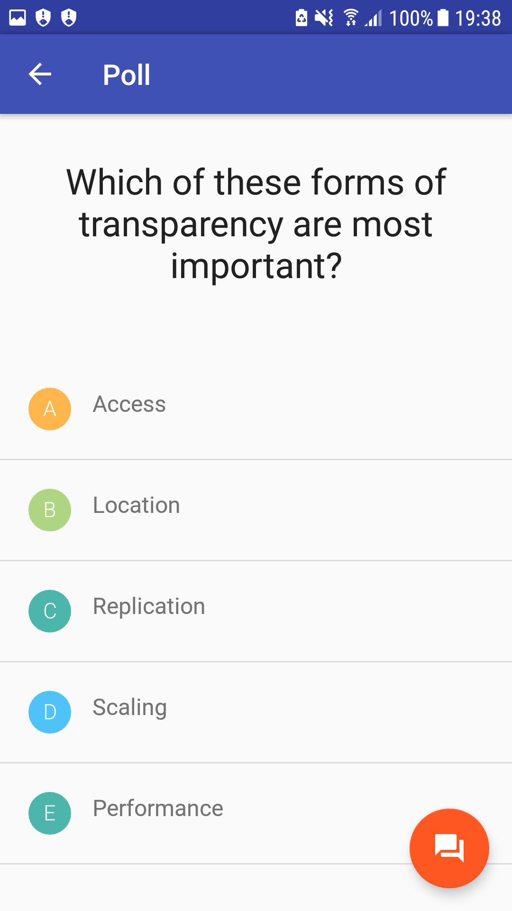

# Tally - Android

Mobile classroom response system applicaiton to allow users to participate in class discussions. Built as part of 2017 Honours Project
and is to be used in conjunction with the web presentation application, [Tally Web](https://github.com/liamo7/Tally).

# Screenshots
 

